# 10 — ERD (Sơ đồ quan hệ thực thể)

> Sơ đồ trực quan cho mô hình dữ liệu ở `04-mo-hinh-du-lieu.md`. Có **2 dạng**:
> 1. **Ảnh PNG dựng sẵn** trong thư mục `erd-images/` (nhúng ngay dưới mỗi mục) — xem được ngay, kể cả khi trình xem không hỗ trợ Mermaid.
> 2. **Source Mermaid** (khối ```mermaid) để chỉnh sửa/version — mở file ở chế độ Preview (Cursor: `Cmd/Ctrl+Shift+V`) để render động.
>
> Muốn dựng lại ảnh sau khi sửa source, xem mục 11.
>
> Ghi chú ký hiệu quan hệ Mermaid: `||--o{` = một–nhiều (0..n) · `||--|{` = một–nhiều (1..n) · `}o--o{` = nhiều–nhiều · `||--||` = một–một.
> Quan hệ **đa hình (polymorphic)** được vẽ bằng đường nét đứt + bảng trung tâm (Note), vì ERD không mô tả trực tiếp polymorphic.

---

## 1. Sơ đồ tổng quan (High-level)

Các thực thể trung tâm và luồng chính. Bỏ bớt cột để dễ nhìn.

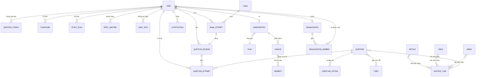

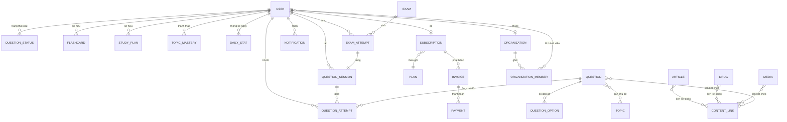

---

## 2. Nhóm Identity & Access

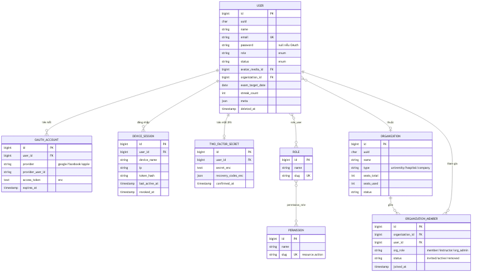

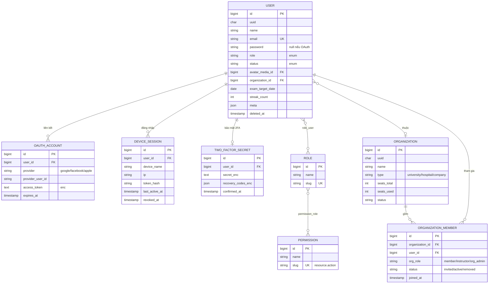

---

## 3. Nhóm Câu hỏi & Học tập (Question & Learning)

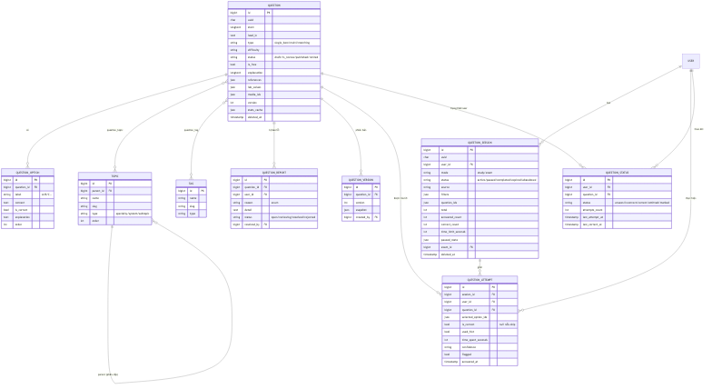

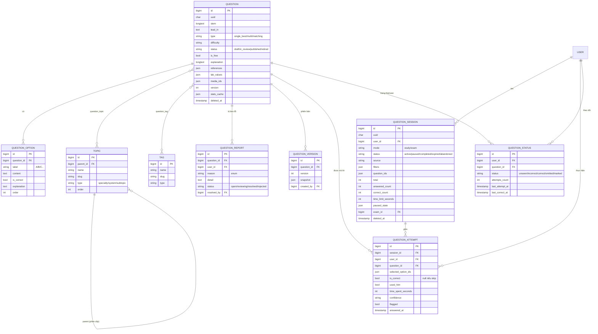

---

## 4. Nhóm Cá nhân hóa (Personalization)

> `NOTE`, `BOOKMARK`, `HIGHLIGHT` là **đa hình** (gắn với Question/Article/Drug/Media/Video...). Cột `*_type` + `*_id` trỏ tới bất kỳ thực thể nào.

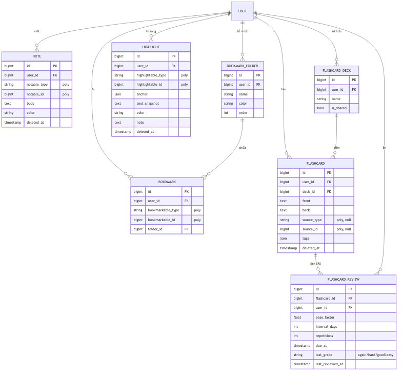

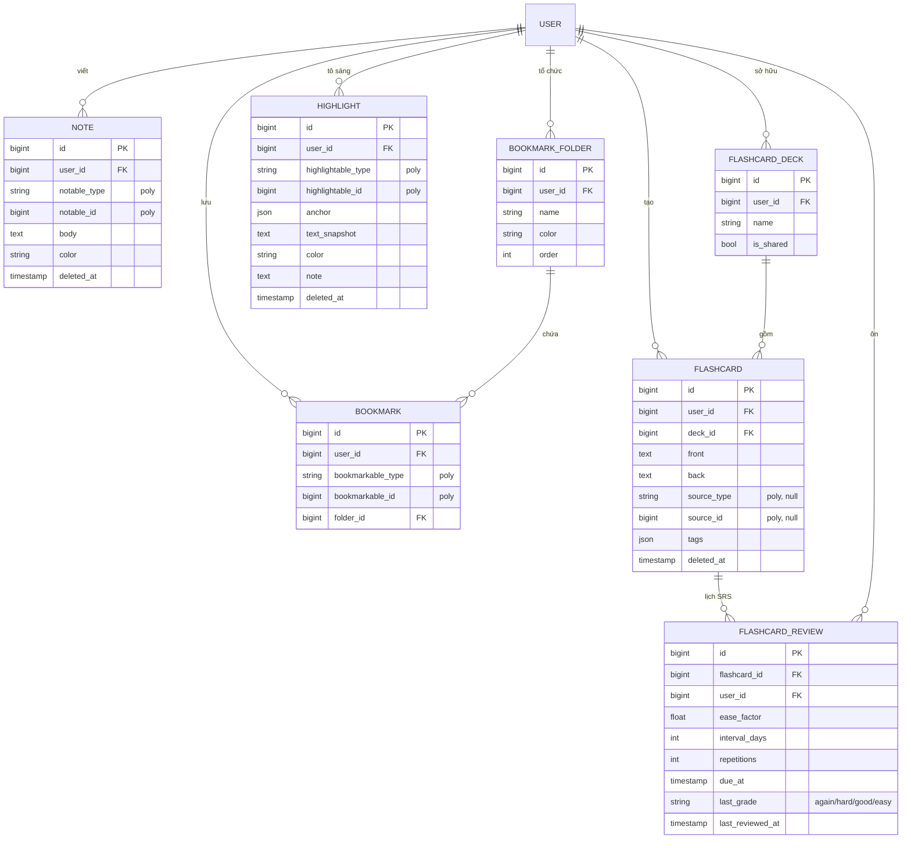

---

## 5. Nhóm Thư viện nội dung (Content Library)

> `CONTENT_LINK` là bảng liên kết chéo **đa hình hai đầu** (source & target): Article ↔ Drug ↔ Media ↔ Question ↔ Procedure.

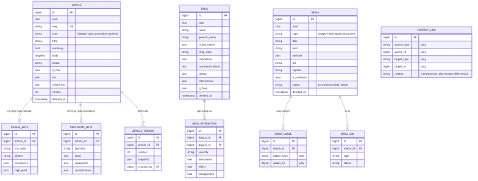

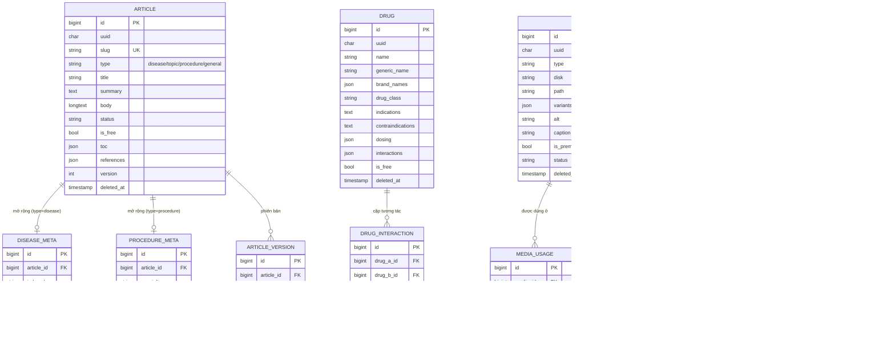

---

## 6. Nhóm Study Plan & Analytics

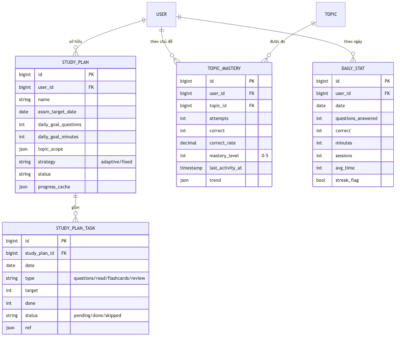

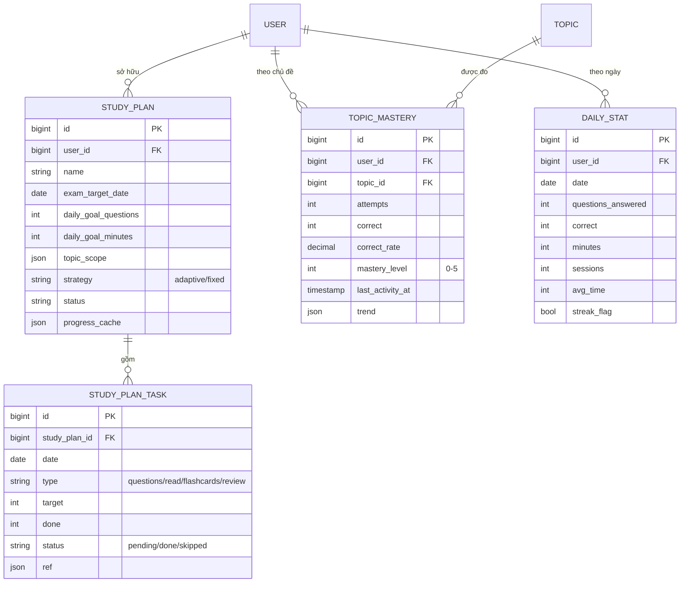

---

## 7. Nhóm Thi cử (Exam)

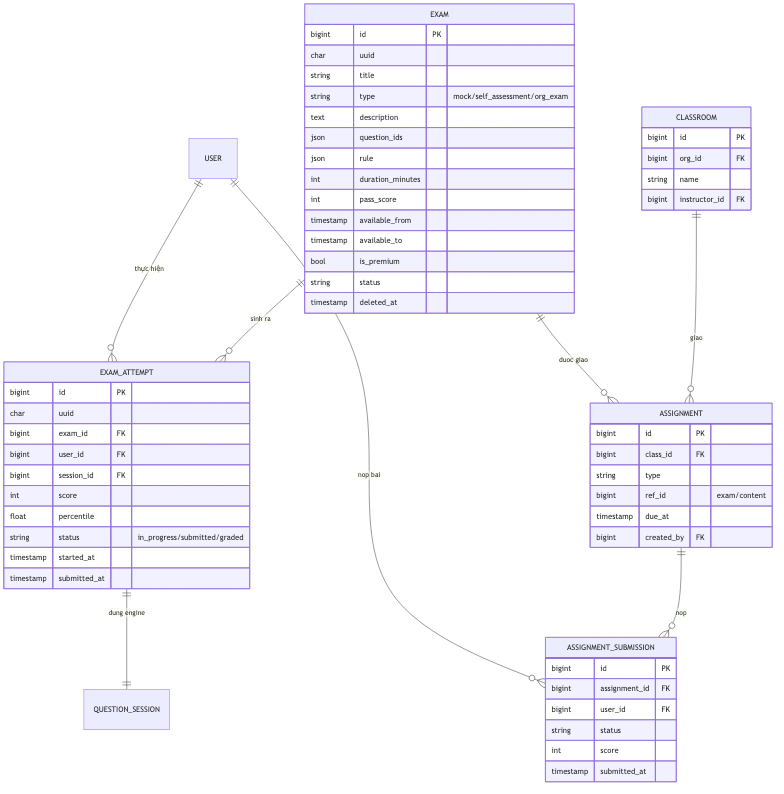

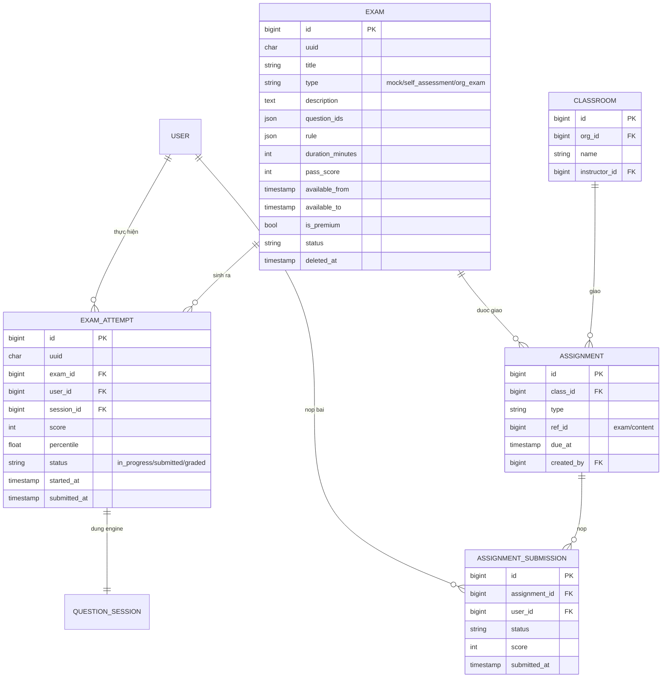

---

## 8. Nhóm Thương mại (Commerce)

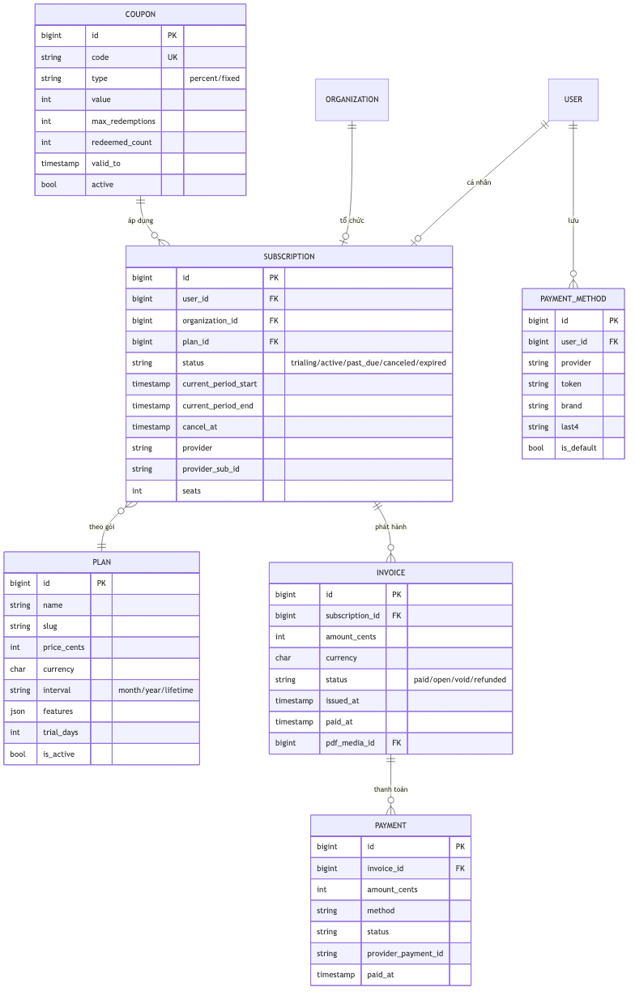

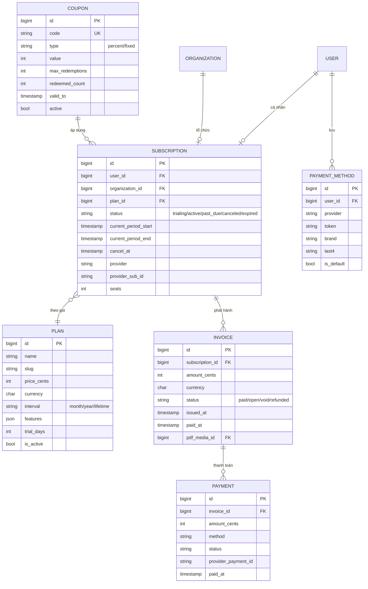

---

## 9. Nhóm Hệ thống (System)

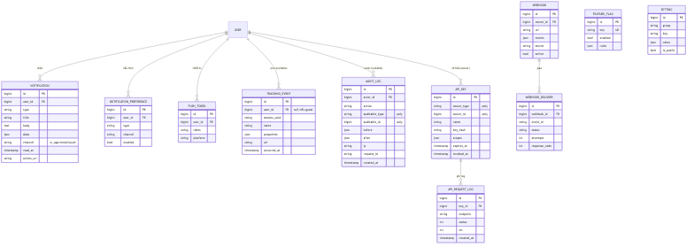

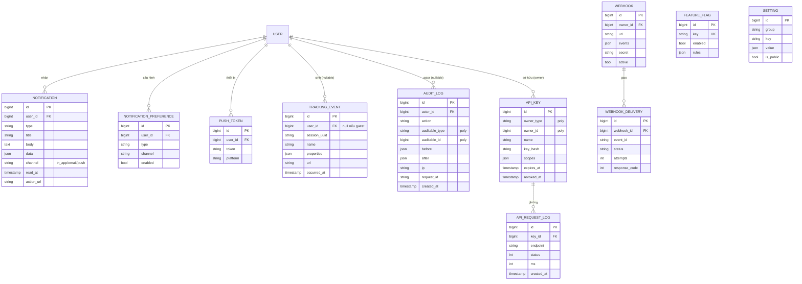

---

## 10. Bản đồ quan hệ đa hình (Polymorphic map)

Các bảng dùng cột `{name}_type` + `{name}_id` để trỏ tới nhiều loại thực thể:

| Bảng | Cột đa hình | Trỏ tới (targets) |
|------|-------------|-------------------|
| NOTE | notable_type/id | Question, Article, Drug, Media, Video |
| BOOKMARK | bookmarkable_type/id | Question, Article, Drug, Procedure, Media, Video |
| HIGHLIGHT | highlightable_type/id | Article, Question (explanation) |
| FLASHCARD | source_type/id | Question, Article |
| MEDIA_USAGE | usable_type/id | Question, Article, Procedure |
| CONTENT_LINK | source & target _type/id | Article, Drug, Media, Question, Procedure |
| AUDIT_LOG | auditable_type/id | mọi entity nghiệp vụ |
| API_KEY | owner_type/id | User, Organization |

---

## 11. Dựng lại ảnh sau khi sửa source

Ảnh trong `erd-images/` được sinh từ các khối ```mermaid của file này bằng Mermaid CLI. Sau khi chỉnh source, chạy lại:

```bash
# Cài Mermaid CLI (một lần)
npm install -g @mermaid-js/mermaid-cli

# Dựng lại toàn bộ (mỗi khối ```mermaid → 1 ảnh erd-N.png)
cd srs/00-nen-tang
mmdc -i 10-erd.md -o erd.png -b white
# → tạo erd-1.png ... erd-9.png (đổi tên/di chuyển vào erd-images/ nếu muốn)

# SVG (nét, phóng to không vỡ)
mmdc -i 10-erd.md -o erd.svg -b white
```

Ngoài ra có thể dán từng khối `mermaid` vào [mermaid.live](https://mermaid.live) để chỉnh và tải ảnh.

> Thứ tự khối ↔ ảnh: 1=Tổng quan · 2=Identity · 3=Question/Learning · 4=Personalization · 5=Content Library · 6=Study Plan/Analytics · 7=Exam · 8=Commerce · 9=System.
