# 11 — ERD đầy đủ (toàn bộ bảng trong một sơ đồ)

> Sơ đồ ERD **tổng hợp mọi bảng** trong phạm vi hiện tại vào một hình duy nhất — dùng để nhìn bao quát toàn bộ mô hình dữ liệu và quan hệ chéo giữa các nhóm.
>
> - Ảnh **SVG** dựng sẵn: `erd-images/full-erd.svg` (phóng to không vỡ nét).
> - Bản chia theo nhóm (dễ đọc từng phần): xem `10-erd.md`.
> - Chi tiết field/type/index: xem `04-mo-hinh-du-lieu.md`.
> - 🔵 **Nhóm Organization** (organizations, organization_members, classrooms, assignments, assignment_submissions) đã **hoãn (Phase 2)** → không có trong sơ đồ này; xem Module 32.
>
> Vì có nhiều bảng, nên mở SVG và phóng to, hoặc render động ở chế độ Preview (`Cmd/Ctrl+Shift+V`).

```mermaid
erDiagram
    %% ===================== IDENTITY & ACCESS =====================
    USER ||--o{ OAUTH_ACCOUNT : "lien ket"
    USER ||--o{ DEVICE_SESSION : "dang nhap"
    USER ||--o| TWO_FACTOR_SECRET : "2FA"
    USER }o--o{ ROLE : "role_user"
    ROLE }o--o{ PERMISSION : "permission_role"

    %% ===================== QUESTION & LEARNING =====================
    QUESTION ||--o{ QUESTION_OPTION : "co dap an"
    QUESTION }o--o{ TOPIC : "question_topic"
    QUESTION }o--o{ TAG : "question_tag"
    QUESTION ||--o{ QUESTION_REPORT : "bi bao loi"
    QUESTION ||--o{ QUESTION_VERSION : "phien ban"
    TOPIC ||--o{ TOPIC : "parent"
    USER ||--o{ QUESTION_SESSION : "tao"
    QUESTION_SESSION ||--o{ QUESTION_ATTEMPT : "gom"
    QUESTION ||--o{ QUESTION_ATTEMPT : "duoc tra loi"
    USER ||--o{ QUESTION_ATTEMPT : "thuc hien"
    USER ||--o{ QUESTION_STATUS : "theo doi"
    QUESTION ||--o{ QUESTION_STATUS : "trang thai/user"

    %% ===================== PERSONALIZATION =====================
    USER ||--o{ NOTE : "viet"
    USER ||--o{ BOOKMARK : "luu"
    USER ||--o{ BOOKMARK_FOLDER : "to chuc"
    BOOKMARK_FOLDER ||--o{ BOOKMARK : "chua"
    USER ||--o{ HIGHLIGHT : "to sang"
    USER ||--o{ FLASHCARD : "tao"
    USER ||--o{ FLASHCARD_DECK : "so huu"
    FLASHCARD_DECK ||--o{ FLASHCARD : "gom"
    FLASHCARD ||--o{ FLASHCARD_REVIEW : "lich SRS"
    USER ||--o{ FLASHCARD_REVIEW : "on"

    %% ===================== CONTENT LIBRARY =====================
    ARTICLE ||--o| DISEASE_META : "type=disease"
    ARTICLE ||--o| PROCEDURE_META : "type=procedure"
    ARTICLE ||--o{ ARTICLE_VERSION : "phien ban"
    DRUG ||--o{ DRUG_INTERACTION : "cap tuong tac"
    MEDIA ||--o{ MEDIA_USAGE : "duoc dung"
    MEDIA ||--o{ MEDIA_JOB : "xu ly"
    ARTICLE }o--o{ CONTENT_LINK : "cross-link"
    DRUG }o--o{ CONTENT_LINK : "cross-link"
    MEDIA }o--o{ CONTENT_LINK : "cross-link"
    QUESTION }o--o{ CONTENT_LINK : "cross-link"

    %% ===================== STUDY PLAN & ANALYTICS =====================
    USER ||--o{ STUDY_PLAN : "so huu"
    STUDY_PLAN ||--o{ STUDY_PLAN_TASK : "gom"
    USER ||--o{ TOPIC_MASTERY : "theo chu de"
    TOPIC ||--o{ TOPIC_MASTERY : "duoc do"
    USER ||--o{ DAILY_STAT : "theo ngay"

    %% ===================== EXAM =====================
    EXAM ||--o{ EXAM_ATTEMPT : "sinh ra"
    USER ||--o{ EXAM_ATTEMPT : "thuc hien"
    EXAM_ATTEMPT ||--|| QUESTION_SESSION : "dung engine"

    %% ===================== COMMERCE =====================
    USER ||--o| SUBSCRIPTION : "ca nhan"
    SUBSCRIPTION }o--|| PLAN : "theo goi"
    SUBSCRIPTION ||--o{ INVOICE : "phat hanh"
    INVOICE ||--o{ PAYMENT : "thanh toan"
    USER ||--o{ PAYMENT_METHOD : "luu"
    COUPON ||--o{ SUBSCRIPTION : "ap dung"

    %% ===================== SYSTEM =====================
    USER ||--o{ NOTIFICATION : "nhan"
    USER ||--o{ NOTIFICATION_PREFERENCE : "cau hinh"
    USER ||--o{ PUSH_TOKEN : "thiet bi"
    USER ||--o{ TRACKING_EVENT : "sinh"
    USER ||--o{ AUDIT_LOG : "actor"
    USER ||--o{ API_KEY : "so huu"
    API_KEY ||--o{ API_REQUEST_LOG : "ghi log"
    WEBHOOK ||--o{ WEBHOOK_DELIVERY : "giao"

    %% ===================== ENTITY DEFINITIONS =====================
    USER {
        bigint id PK
        char uuid
        string name
        string email UK
        string role "enum"
        string status "enum"
        date exam_target_date
        int streak_count
        timestamp deleted_at
    }
    OAUTH_ACCOUNT {
        bigint id PK
        bigint user_id FK
        string provider
        string provider_user_id
    }
    DEVICE_SESSION {
        bigint id PK
        bigint user_id FK
        string device_name
        string token_hash
        timestamp revoked_at
    }
    TWO_FACTOR_SECRET {
        bigint id PK
        bigint user_id FK
        text secret_enc
        timestamp confirmed_at
    }
    ROLE {
        bigint id PK
        string name
        string slug UK
    }
    PERMISSION {
        bigint id PK
        string slug UK "resource.action"
    }
    QUESTION {
        bigint id PK
        char uuid
        longtext stem
        string type
        string difficulty
        string status
        bool is_free
        int version
        timestamp deleted_at
    }
    QUESTION_OPTION {
        bigint id PK
        bigint question_id FK
        string label
        bool is_correct
        int order
    }
    TOPIC {
        bigint id PK
        bigint parent_id FK
        string name
        string type
    }
    TAG {
        bigint id PK
        string name
        string slug
    }
    QUESTION_REPORT {
        bigint id PK
        bigint question_id FK
        bigint user_id FK
        string reason
        string status
    }
    QUESTION_VERSION {
        bigint id PK
        bigint question_id FK
        int version
        json snapshot
    }
    QUESTION_SESSION {
        bigint id PK
        char uuid
        bigint user_id FK
        string mode
        string status
        bigint exam_id FK
        int time_limit_seconds
        json paused_state
        timestamp deleted_at
    }
    QUESTION_ATTEMPT {
        bigint id PK
        bigint session_id FK
        bigint user_id FK
        bigint question_id FK
        bool is_correct
        int time_spent_seconds
        bool flagged
        timestamp answered_at
    }
    QUESTION_STATUS {
        bigint id PK
        bigint user_id FK
        bigint question_id FK
        string status
        int attempts_count
    }
    NOTE {
        bigint id PK
        bigint user_id FK
        string notable_type "poly"
        bigint notable_id "poly"
        text body
        timestamp deleted_at
    }
    BOOKMARK {
        bigint id PK
        bigint user_id FK
        string bookmarkable_type "poly"
        bigint bookmarkable_id "poly"
        bigint folder_id FK
    }
    BOOKMARK_FOLDER {
        bigint id PK
        bigint user_id FK
        string name
    }
    HIGHLIGHT {
        bigint id PK
        bigint user_id FK
        string highlightable_type "poly"
        bigint highlightable_id "poly"
        json anchor
        string color
        timestamp deleted_at
    }
    FLASHCARD {
        bigint id PK
        bigint user_id FK
        bigint deck_id FK
        text front
        text back
        string source_type "poly"
        bigint source_id "poly"
        timestamp deleted_at
    }
    FLASHCARD_REVIEW {
        bigint id PK
        bigint flashcard_id FK
        bigint user_id FK
        float ease_factor
        int interval_days
        timestamp due_at
    }
    FLASHCARD_DECK {
        bigint id PK
        bigint user_id FK
        string name
        bool is_shared
    }
    ARTICLE {
        bigint id PK
        char uuid
        string slug UK
        string type
        string title
        string status
        bool is_free
        int version
        timestamp deleted_at
    }
    DISEASE_META {
        bigint id PK
        bigint article_id FK
        string icd_code
        string system
    }
    PROCEDURE_META {
        bigint id PK
        bigint article_id FK
        string specialty
        json steps
    }
    ARTICLE_VERSION {
        bigint id PK
        bigint article_id FK
        int version
        json snapshot
    }
    DRUG {
        bigint id PK
        char uuid
        string name
        string drug_class
        bool is_free
        timestamp deleted_at
    }
    DRUG_INTERACTION {
        bigint id PK
        bigint drug_a_id FK
        bigint drug_b_id FK
        string severity
    }
    MEDIA {
        bigint id PK
        char uuid
        string type
        string path
        bool is_premium
        string status
        timestamp deleted_at
    }
    MEDIA_USAGE {
        bigint id PK
        bigint media_id FK
        string usable_type "poly"
        bigint usable_id "poly"
    }
    MEDIA_JOB {
        bigint id PK
        bigint media_id FK
        string type
        string status
    }
    CONTENT_LINK {
        bigint id PK
        string source_type "poly"
        bigint source_id "poly"
        string target_type "poly"
        bigint target_id "poly"
        string relation
    }
    STUDY_PLAN {
        bigint id PK
        bigint user_id FK
        date exam_target_date
        int daily_goal_questions
        string strategy
        string status
    }
    STUDY_PLAN_TASK {
        bigint id PK
        bigint study_plan_id FK
        date date
        string type
        int target
        int done
        string status
    }
    TOPIC_MASTERY {
        bigint id PK
        bigint user_id FK
        bigint topic_id FK
        decimal correct_rate
        int mastery_level
    }
    DAILY_STAT {
        bigint id PK
        bigint user_id FK
        date date
        int questions_answered
        int correct
        int minutes
    }
    EXAM {
        bigint id PK
        char uuid
        string title
        string type
        int duration_minutes
        int pass_score
        bool is_premium
        string status
        timestamp deleted_at
    }
    EXAM_ATTEMPT {
        bigint id PK
        char uuid
        bigint exam_id FK
        bigint user_id FK
        bigint session_id FK
        int score
        float percentile
        string status
    }
    PLAN {
        bigint id PK
        string name
        int price_cents
        char currency
        string interval
        bool is_active
    }
    SUBSCRIPTION {
        bigint id PK
        bigint user_id FK
        bigint plan_id FK
        string status
        timestamp current_period_end
        int seats
    }
    INVOICE {
        bigint id PK
        bigint subscription_id FK
        int amount_cents
        string status
        timestamp paid_at
    }
    PAYMENT {
        bigint id PK
        bigint invoice_id FK
        int amount_cents
        string method
        string status
    }
    PAYMENT_METHOD {
        bigint id PK
        bigint user_id FK
        string provider
        string last4
        bool is_default
    }
    COUPON {
        bigint id PK
        string code UK
        string type
        int value
        bool active
    }
    NOTIFICATION {
        bigint id PK
        bigint user_id FK
        string type
        string channel
        timestamp read_at
    }
    NOTIFICATION_PREFERENCE {
        bigint id PK
        bigint user_id FK
        string type
        string channel
        bool enabled
    }
    PUSH_TOKEN {
        bigint id PK
        bigint user_id FK
        string token
        string platform
    }
    TRACKING_EVENT {
        bigint id PK
        bigint user_id FK
        string name
        json properties
        timestamp occurred_at
    }
    AUDIT_LOG {
        bigint id PK
        bigint actor_id FK
        string action
        string auditable_type "poly"
        bigint auditable_id "poly"
        timestamp created_at
    }
    FEATURE_FLAG {
        bigint id PK
        string key UK
        bool enabled
        json rules
    }
    SETTING {
        bigint id PK
        string group
        string key
        json value
    }
    API_KEY {
        bigint id PK
        string owner_type "poly"
        bigint owner_id "poly"
        string key_hash
        json scopes
    }
    API_REQUEST_LOG {
        bigint id PK
        bigint key_id FK
        string endpoint
        int status
    }
    WEBHOOK {
        bigint id PK
        bigint owner_id FK
        string url
        json events
        bool active
    }
    WEBHOOK_DELIVERY {
        bigint id PK
        bigint webhook_id FK
        string event_id
        string status
        int attempts
    }
```





## Dựng lại ảnh SVG

```bash
cd srs/00-nen-tang
mmdc -i 11-erd-full.md -o erd-images/full-erd.svg -b white
# → tạo full-erd-1.svg (đổi tên thành full-erd.svg nếu cần)
```
