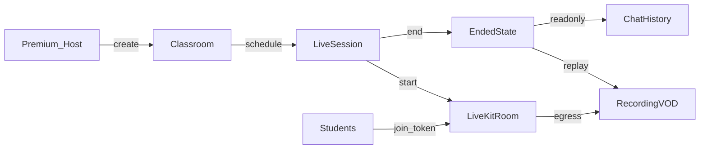

# Module 44 — Classroom / Live Review (Lớp chữa đề livestream)

**Nhóm:** Community · **Ưu tiên:** Cao · **Phụ thuộc:** Auth (02), Subscription (28), Videos (14 — player HLS), Notification (27), Exam/Qbank (05/23, liên kết đề tùy chọn) · **Trạng thái:** 🟡

> **Phân biệt Module 32 Organization (🔵 Phase 2):** Organization là **B2B** (ghế license, org_admin, assignment trong tổ chức). Module 44 là **B2C cộng đồng** — giảng viên host lớp chữa đề qua `/teach`, **không** phụ thuộc `organizations` / `classes` của Org. Tên bảng dùng `classrooms` / `live_sessions` để tránh đụng `classes` Phase 2. Khi bật Org sau này có thể liên kết lớp cộng đồng ↔ lớp tổ chức (ngoài phạm vi hiện tại).

## 0. Tóm tắt module
Không gian **lớp chữa đề** với **livestream LiveKit (WebRTC)**: **giảng viên** tạo lớp trên `/teach` (chờ **admin duyệt** trước khi hiển thị catalog học viên), lên lịch buổi live; học viên đăng nhập tham gia nếu được phép. Trong lúc `live`: video/audio + chat/Q&A/raise-hand. Sau `ended`: tắt giao tiếp realtime; lớp vẫn xem được metadata, **recording VOD (HLS)**, lịch sử chat **read-only**, tài liệu/đề gắn kèm.

| Route | Màn hình | Quyền |
|-------|----------|-------|
| `/classes` | Catalog lớp (chỉ lớp đã duyệt + public/unlisted mình biết) | Auth (learner) |
| ~~`/classes/create`~~ | ~~Tạo lớp~~ | **Tắt tạm** — học viên không tạo lớp |
| `/classes/{id}` | Chi tiết lớp: mô tả, lịch, thành viên, recording | Member / viewer theo visibility + lớp `active` |
| `/classes/{id}/settings` | Cài đặt lớp (host/cohost) | Host / cohost |
| `/classes/{id}/live/{session}` | Phòng live (viewer) hoặc host studio | Member + session live/ended (VOD) |
| `/classes/{id}/live/{session}/host` | Host studio (publish cam/mic/screen) | Host / cohost |
| `/teach/classes/create` | Tạo lớp (giảng viên) | Role `instructor` |
| `/admin/classrooms` | Giám sát + **duyệt/từ chối** lớp chờ + **tạo lớp thay giảng viên** | `classroom.oversee` / `classroom.create_on_behalf` |
| `/admin/classrooms/create` | Admin tạo lớp → **chọn Host (bắt buộc)** từ danh sách `instructor` | `classroom.create_on_behalf` |

Không bao gồm: quản lý tổ chức/ghế B2B (32), CMS marketing (42), thư viện video bài giảng tĩnh (14 — chỉ **tái dùng player** cho VOD).

## 1. Tổng quan từng màn hình

### 1.1 Catalog (`/classes`)
- **Mục đích:** Khám phá lớp public **đã được admin duyệt**; vào lớp đã join; **không** có CTA tạo lớp (tắt tạm học viên host).
- **Khi dùng:** Muốn học chữa đề cùng cộng đồng / tìm buổi live sắp diễn ra.
- **Đến từ:** Sidebar, Dashboard widget “Đang live”, deep link notification, search.
- **Đi sang:** `/classes/{id}` (lớp đã duyệt).

### 1.2 Chi tiết lớp (`/classes/{id}`)
- **Mục đích:** Xem mô tả, lịch session, danh sách recording, join/leave, invite.
- **Đi sang:** Phòng live / VOD replay, settings (host), Qbank/Exam liên kết.

### 1.3 Phòng live / Host studio
- **Mục đích:** Tham gia WebRTC (LiveKit); host publish; viewer subscribe + chat.
- **Khi `ended`:** Player VOD (Module 14 pattern) + chat read-only + banner “Buổi live đã kết thúc”.

## 2. Phân tích giao diện

| Thành phần | Chức năng | Hiển thị | Ẩn | Điều kiện | Responsive |
|-----------|-----------|----------|-----|-----------|-----------|
| **Class catalog** | Grid/list lớp + filter (live now / sắp tới / đã join) | `/classes` | — | Auth | Grid → list |
| **Live now badge** | Badge đỏ “LIVE” + số viewer | Catalog + detail | Khi không live | Reverb presence | — |
| **Create class CTA** | ~~Nút tạo lớp học viên~~ | — | Catalog learner | **Tắt tạm** | — |
| **Admin approve class** | Duyệt / từ chối lớp `pending_approval` | `/admin/classrooms` | — | `classroom.oversee` | — |
| **Class header** | Cover, title, host, visibility, join code | Detail | — | — | Stack mobile |
| **Session list** | Lịch scheduled / live / ended + CTA | Detail | — | — | Card |
| **Member roster** | Thành viên, role_in_class, ban | Detail / live sidebar | Invite-only ẩn roster public | Host xem đủ; member tùy setting | Drawer mobile |
| **Join / Leave / Invite** | Tham gia bằng code/link/invite | Detail | Đã là member → Leave | Theo visibility | — |
| **Host studio layout** | Preview local + controls cam/mic/screen + start/end live | `/host` | Viewer | Host/cohost | Desktop ưu tiên |
| **Viewer stage** | Remote video/audio LiveKit | Live room | Khi ended → VOD player | Session `live` | Full-bleed |
| **VOD player** | HLS recording (tái dùng Videos 14) | Session `ended` + recording ready | Processing/failed | Member | Full-width |
| **Chat panel** | Gửi/nhận tin; Q&A pin | Live | Ended: read-only | POST chỉ khi `live` | Bottom sheet mobile |
| **Raise hand** | Xin phát biểu | Live | Ended / bị ban | Member | — |
| **Moderation toolbar** | Mute chat user, xóa tin, ban, end live | Host studio | Viewer | Host/cohost | — |
| **Paywall / Empty / Loading / Error** | Chuẩn | Theo trạng thái | — | — | — |

## 3. Phân tích Component

### `ClassroomCard`
- **Props:** `classroom`, `liveSession?`, `viewerCount?`.
- **Events:** `onOpen`, `onJoin`.
- **Permission:** Public hiện catalog; unlisted chỉ khi có link/code hoặc đã member.

### `LiveKitRoom`
- **Props:** `token`, `roomName`, `role(publisher|subscriber)`, `onDisconnected`.
- **State:** `connected`, `tracks`, `devices`, `reconnecting`.
- **Events:** `onTrackSubscribed`, `onParticipantLeft`, `onError`.
- **Permission:** Token server-issued; chỉ host/cohost `canPublish`.
- **Loading:** Connecting spinner. **Error:** retry / fallback audio-only. **Disabled:** session ended → không connect.

### `HostStudioControls`
- **Props:** `session`, `isLive`.
- **State:** `camOn`, `micOn`, `screenShare`, `ending`.
- **Events:** `onStartLive`, `onEndLive`, `onToggleDevice`.
- **Validation:** Confirm trước khi end (mất realtime).

### `LiveChatPanel`
- **Props:** `sessionId`, `messages[]`, `mode(live|readonly)`, `canModerate`.
- **State:** `draft`, `filter(all|questions)`.
- **Events:** `onSend`, `onDelete`, `onPin`, `onRaiseHand`.
- **Validation:** Rate-limit; max length; block khi `mode=readonly` hoặc banned.
- **A11y:** live region cho tin mới (giảm khi volume cao).

### `VodReplayPlayer`
- Tái dùng `VideoPlayer` (Module 14) với `media` từ `live_recordings`.

### Khác
`JoinCodeModal`, `InviteMemberModal`, `SessionScheduleForm`, `RecordingStatusBadge`, `PaywallOverlay` (host).

## 4. Luồng người dùng

```
[Giảng viên /teach]
/teach/classes/create → tạo classroom (status pending_approval)
→ Admin duyệt (/admin/classrooms) → status active → hiện catalog học viên
→ Schedule live_session → (optional) gắn exam/question set
→ Tới giờ: host studio → Start live (chỉ khi active) → LiveKit room + egress
→ Publish A/V → Members join bằng token subscriber
→ Chat/Q&A → End live → room đóng, chat khóa, egress → R2 HLS
→ Members xem VOD + chat history read-only

[Học viên Free/Premium]
Catalog (lớp active) / invite / join_code → Join classroom
→ Notification "live sắp bắt đầu" → vào room khi live
→ Sau end: mở lại lớp xem recording (không chat gửi mới)

Ngoại lệ:
- Học viên **không** tạo lớp (route `/classes/create` tắt tạm)
- Lớp chưa duyệt: ẩn catalog; host vẫn xem trên `/teach`; chặn start live
- Host mất Premium (legacy community host) → không start live mới; VOD/read-only vẫn OK
- Recording processing → badge "Đang xử lý"; failed → retry egress (host/admin)
```



## 5. Business Logic

- **Tạo lớp (đã chốt 2026-08-14, bổ sung 2026-08-23):**
  - **Giảng viên** (`instructor`) tạo trên `/teach/classes/create`.
  - **Admin** có thể tạo lớp trên `/admin/classrooms/create` — **bắt buộc chọn Host** từ danh sách user có role `instructor` (không cho user không phải giảng viên).
  - Lớp mới: `status = pending_approval` (trừ khi admin bật auto-approve nội bộ) — **chưa** hiện catalog học viên, **chưa** join public, **chưa** start live.
  - Admin duyệt → `active`; từ chối → `archived`.
  - Học viên Premium host cộng đồng trên `/classes`: **tắt tạm** (Phase sau có thể bật lại).
- **Host entitlement (legacy):**
  - Premium `classroom.host`: giữ quyền vận hành lớp cộng đồng cũ (nếu có); không tạo lớp mới trên learner UI.
  - Instructor: host trên `/teach` theo **role** (không phụ thuộc Premium).
  - Free: join được (lớp đã duyệt), không create/start.
  - Admin: oversight (`classroom.oversee`), duyệt lớp, force-end, archive.
- **Visibility:** `public` (catalog), `unlisted` (link/code), `invite_only` (chỉ invite).
- **Membership:** `host` / `cohost` / `member`; status `invited` / `active` / `left` / `banned`.
- **Session lifecycle:** `scheduled` → `live` → `ended` | `cancelled`. Chỉ 1 session `live` / classroom tại một thời điểm (MVP).
- **LiveKit:** App **không** tự build SFU; server cấp **JWT join token** (TTL ngắn), `roomName` = `livekit_room_name`. Host/cohost: publish; member: subscribe (+ data nếu cần).
- **Chat nguồn thật = MySQL** (`live_session_messages`); broadcast Reverb khi live. POST bị từ chối nếu session ≠ `live` hoặc user banned.
- **Sau `ended`:** Ngắt LiveKit room; không cấp token mới; UI VOD + chat read-only; Reverb chỉ còn event nhẹ (vd recording_ready) nếu cần.
- **Recording:** LiveKit Egress → file → R2/S3 + HLS (pattern Module 14); webhook cập nhật `live_recordings`.
- **Linked content:** optional `linked_exam_id` / `question_set` JSON — deep link sang Qbank/Exam, không chấm điểm trong phòng live (MVP).
- **Host hết Premium:** giữ lớp + VOD; chặn `live.start` / tạo lớp mới đến khi có lại entitlement.
- **Moderation:** host/cohost xóa tin, ban member, tắt chat tạm thời (flag session).

## 6. Database

Tham chiếu nhóm Classroom trong `04-mo-hinh-du-lieu.md`.

| Entity | Field chính |
|--------|-------------|
| **Classroom** | `id, uuid, title, description, host_user_id, visibility(public/unlisted/invite_only), join_code, status(draft/pending_approval/active/archived), max_members, cover_media_id, meta JSON` |
| **ClassroomMember** | `classroom_id, user_id, role_in_class(host/cohost/member), status(invited/active/left/banned), joined_at` — unique `(classroom_id, user_id)` |
| **LiveSession** | `classroom_id, title, scheduled_at, started_at, ended_at, status(scheduled/live/ended/cancelled), livekit_room_name, linked_exam_id null, question_set JSON null` |
| **LiveSessionMessage** | `live_session_id, user_id, body, type(chat/question/system), is_hidden, created_at` |
| **LiveRecording** | `live_session_id, media_id, duration_seconds, status(processing/ready/failed), egress_id` |

> Không dùng tên `classes` (dành Phase 2 Organization).

## 7. API

| Method | URL | Payload | Response | Quyền |
|--------|-----|---------|----------|-------|
| GET | `/api/v1/classrooms` | filter | list | Auth |
| POST | `/api/v1/classrooms` | title, visibility… | classroom | Role `instructor` (portal teach) |
| POST | `/api/v1/admin/classrooms` | title, visibility, **`host_user_id`** (instructor) | classroom | `classroom.create_on_behalf` |
| GET/PATCH | `/api/v1/classrooms/{id}` | — / update | classroom | view / `classroom.manage` |
| POST | `/api/v1/classrooms/{id}/join` | `{code?}` | membership | Auth + visibility |
| POST | `/api/v1/classrooms/{id}/leave` | — | ok | Member |
| POST | `/api/v1/classrooms/{id}/invite` | `{emails[]/user_ids[]}` | invites | Host/cohost |
| GET/POST | `/api/v1/classrooms/{id}/sessions` | schedule body | sessions | Member / host |
| POST | `/api/v1/sessions/{id}/start` | — | session live + room | Host/cohost + entitlement |
| POST | `/api/v1/sessions/{id}/end` | — | session ended | Host/cohost |
| POST | `/api/v1/sessions/{id}/token` | — | `{token, url, role}` | Active member; chỉ khi `live` |
| GET/POST | `/api/v1/sessions/{id}/messages` | `{body,type}` | messages | GET: member; POST: chỉ `live` |
| DELETE | `/api/v1/sessions/{id}/messages/{msg}` | — | 204 | Author hoặc moderate |
| POST | `/api/v1/sessions/{id}/raise-hand` | — | ok | Member + live |
| POST | `/api/v1/webhooks/livekit` | egress events | 200 | Signed webhook |
| GET | `/api/v1/sessions/{id}/recording` | — | signed HLS | Member |

**Error codes (điển hình):** `403` thiếu entitlement/banned; `409` đã có session live; `422` POST chat khi ended; `429` chat flood; `404` unlisted không đủ điều kiện.

## 8. State Management

- **Server:** classroom/membership/session trong MySQL; LiveKit room ephemeral; recording status qua webhook + queue.
- **Redis:** rate-limit chat; cache “live now” catalog; presence count (kèm Reverb).
- **Client:** LiveKit JS room state; chat list (optimistic send khi live); VOD player state.
- **Realtime:** Reverb `presence-classroom.{id}` (badge live, roster), `private-live-session.{id}` (chat, session.ended, recording_ready). Media path = LiveKit, không đi Reverb.
- **Optimistic:** gửi chat; rollback nếu 422/429.

## 9. Phân quyền

| Actor | Được làm |
|-------|----------|
| **Guest** | Không (redirect login) |
| **Student Free** | Join lớp **đã duyệt** (public/unlisted); xem live + VOD; **không** create |
| **Premium** | ~~Host lớp cộng đồng trên `/classes`~~ **tắt tạm** |
| **Instructor** | Portal **`/teach`**: tạo lớp (chờ duyệt), chạy buổi chữa sau duyệt; gắn đề feedback/exam |
| **Content Editor** | Không host mặc định |
| **Admin / Super Admin** | **Oversight** (`classroom.oversee`): duyệt/từ chối lớp, xem mọi lớp, force-end, archive; **tạo lớp** gán host instructor (`classroom.create_on_behalf`) — **không** thay giảng viên chữa đề hàng ngày |

Permissions: `classroom.create` (instructor), `classroom.create_on_behalf` (admin), `classroom.manage`, `classroom.join`, `classroom.moderate`, `classroom.oversee`, `live.start`, `live.join`, `live.force_end`. Entitlement `classroom.host` = Premium cộng đồng (legacy); Instructor host bằng **role**.

## 10. Edge Cases

| Case | Xử lý |
|------|-------|
| Mất mạng giữa live (viewer) | LiveKit reconnect; chat queue local ngắn; Resync messages |
| Host disconnect | Grace period → auto-end hoặc cohost takeover (nếu có) |
| Token hết hạn | Refresh token API; không publish nếu không còn quyền |
| Subscription hết lúc đang live | Cho **kết thúc** buổi hiện tại; chặn start buổi sau |
| Duplicate start | Idempotent / `409` nếu đã live |
| Egress failed | `live_recordings.status=failed`; notify host; cho retry |
| Join invite_only không invite | `403` |
| Refresh/back khi live | Re-fetch token + reconnect; không tạo session mới |
| Concurrent ban + đang trong room | Revoke: kick qua LiveKit API + từ chối token/chat |
| Join lớp chưa duyệt | `403` / ẩn catalog |
| Start live lớp chưa duyệt | `403` |

## 11. Tracking

`classroom_create`, `classroom_join`, `classroom_leave`, `classroom_invite`, `live_schedule`, `live_start`, `live_join`, `live_end`, `live_chat_send`, `live_raise_hand`, `live_moderate`, `recording_ready`, `recording_play`, `paywall_view` (source=`classroom_host`).

Properties gợi ý: `classroom_id`, `session_id`, `visibility`, `role_in_class`, `viewer_count`, `duration_seconds`.

## 12. Responsive

- **Desktop:** catalog grid; detail 2 cột; host studio (stage + chat + roster); viewer stage rộng + chat phải.
- **Tablet:** stage trên, chat dưới/tab.
- **Mobile:** catalog list; live full-bleed video; chat bottom sheet; host studio cảnh báo “nên dùng desktop” (vẫn cho publish cam/mic cơ bản); VOD như Module 14.

## 13. Security

- Join token **TTL ngắn**, signed server-side; `canPublish` chỉ host/cohost.
- Kiểm tra membership + session `live` trước khi cấp token (chống IDOR).
- Webhook LiveKit verify signature; egress URL không public thô.
- VOD: signed HLS + watermark user id (cùng hướng Module 14).
- Moderated chat; rate-limit; audit `live_start` / `live_end` / ban.
- Không lộ join_code của lớp invite_only trên catalog/API list công khai.

## 14. Performance

- Scale viewer → LiveKit Cloud hoặc SFU đủ CPU/bandwidth; app stateless.
- Chat: paginate lịch sử; broadcast chỉ subscriber phòng; rate-limit.
- Catalog “live now” cache Redis ngắn; invalidate khi start/end.
- Egress + HLS đóng gói qua queue; CDN cho VOD.
- Prefetch recording khi user mở session ended.

## 15. Đề xuất cải tiến

- Breakout rooms; co-host promote từ raise-hand có A/V publish tạm thời.
- Whiteboard / slide sync; chèn câu hỏi poll trong live (gắn Qbank).
- Clip highlight tự động từ recording; transcript + AI tóm tắt buổi chữa.
- Liên kết Phase 2: map `classroom` ↔ Organization `class` cho trường thuê host nội bộ.
- Lịch nhắc calendar (ICS); waitlist khi `max_members`.

## 16. Đã chốt — Instructor portal & oversight (2026-08-09)

> **Quyết định sản phẩm:** Super Admin/Admin **không** quản lý lớp như giảng viên. Giảng viên là actor riêng (không learner, không admin CMS).

### Nguyên tắc
- **Admin = governance** (oversight, gán instructor, force-end, archive).
- **Instructor = operations** (tạo buổi chữa, gắn đề, live host studio).
- **Learner = participation** (join, xem live/VOD).
- Premium host cộng đồng vẫn trên `/classes` — **song song**, không thay `/teach`.

### Portal `/teach` (UI)
| Route | Màn |
|-------|-----|
| `/teach/login`, `/teach/logout` | Đăng nhập giảng viên (tách portal, cùng `web` session) |
| `/teach` | Dashboard: sắp/đang live, lớp của tôi, câu cần chữa |
| `/teach/classes`, `/teach/classes/create`, `/teach/classes/{id}` | CRUD lớp mình host/cohost |
| `/teach/review-queue` | Hàng đợi từ feedback/report QBank |
| `/teach/exams/{id}/review` | Chọn exam → tạo session chữa |
| Host studio | Tái dùng LiveKit presenter (Module 44 hiện có) |

Layout: teaching console (không sidebar Users/Roles/CMS).

### Admin oversight
- Menu `/admin`: **Lớp học (giám sát)** — list mọi lớp, filter host/status, **duyệt / từ chối** lớp `pending_approval`, force-end / archive.
- Không phải workspace chữa đề.

### `purpose` lớp (cùng bảng `classrooms`)
| Value | Nguồn đề | Host chính |
|-------|----------|------------|
| `community_review` | Cộng đồng / Premium | **Tắt tạm** trên `/classes` |
| `feedback_review` | Feedback / report QBank | Instructor `/teach` |
| `exam_review` | Exam / kỳ thi | Instructor `/teach` |

## 17. Đã chốt — Duyệt lớp & tắt học viên host (2026-08-14)

- Học viên **không** tạo lớp trên `/classes` (route/UI tắt tạm).
- **Giảng viên** tạo lớp trên `/teach/classes/create` → `status = pending_approval`.
- **Admin** duyệt (`active`) hoặc từ chối (`archived`) trên `/admin/classrooms`.
- Catalog học viên chỉ liệt kê lớp `active` + public (và lớp đã join).
- Chặn join / start live khi lớp chưa duyệt.

### Roadmap triển khai
| Phase | Nội dung | Trạng thái |
|-------|----------|------------|
| **A** | Role `instructor` + `/teach` shell + middleware tách portal + admin oversight list | ✅ Done |
| **B** | Review queue từ feedback QBank → `question_set` | Pending |
| **C** | Chữa theo exam + cohost nhiều GV | Pending |
| **D** | Liên kết Org B2B (Module 32) — ngoài phạm vi hiện tại | Pending |
